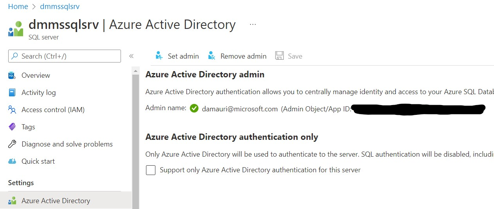
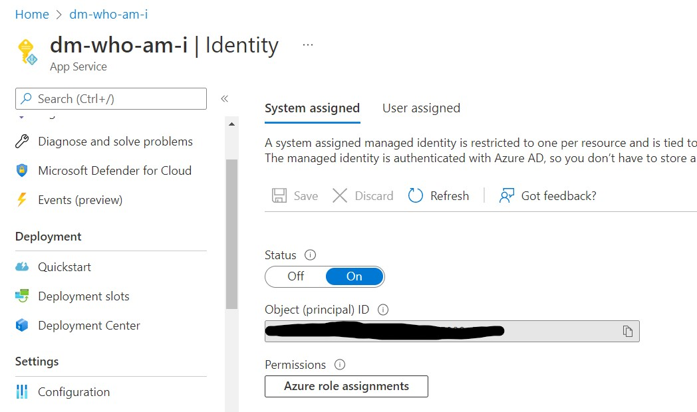

# Azure SQL Database Passwordless Connections


<!-- 
Guidelines on README format: https://review.docs.microsoft.com/help/onboard/admin/samples/concepts/readme-template?branch=master

Guidance on onboarding samples to docs.microsoft.com/samples: https://review.docs.microsoft.com/help/onboard/admin/samples/process/onboarding?branch=master

Taxonomies for products and languages: https://review.docs.microsoft.com/new-hope/information-architecture/metadata/taxonomies?branch=master
-->

- [Azure SQL Database Passwordless Connections](#azure-sql-database-passwordless-connections)
  - [Pre-Requisites](#pre-requisites)
  - [1. Create an Application](#1-create-an-application)
  - [2. Activate the Managed Identity](#2-activate-the-managed-identity)
  - [3. Create the database user for the created Managed Identity](#3-create-the-database-user-for-the-created-managed-identity)
  - [4. Assign permissions](#4-assign-permissions)
  - [5. Set the Connection String](#5-set-the-connection-string)
  - [Testing the sample](#testing-the-sample)
  - [Bonus Content](#bonus-content)
    - [Passthrough Authentication](#passthrough-authentication)
    - [Impersonation](#impersonation)
    - [Supporting SQL Authentication](#supporting-sql-authentication)

Building solutions that can take advtange of Azure SQL Database without the need to worry about passwords is a best practice. Your application we'll be more secure and you don't have to worry about changing and updating password to keep them secure. 

To go passwordless you only need to follow this 5 steps:

## Pre-Requisites

Please note the is assumed that you already have an Azure SQL server and Azure SQL database ready to use for this sample. Full documentation on how to create both an Azure SQL server and an Azure SQL database is here:
[Quickstart: Create a single database - Azure SQL Database](https://docs.microsoft.com/en-us/azure/azure-sql/database/single-database-create-quickstart?view=azuresql&tabs=azure-portal)


Make sure that you have assigned an Azure Active Directory user as the Azure SQL server administrator: [Configure and manage Azure AD authentication with Azure SQL](https://docs.microsoft.com/en-us/azure/azure-sql/database/authentication-aad-configure?view=azuresql&tabs=azure-powershell)

Using CLI, for example, if you want to associate your account as the Azure SQL administrator:

Get the user Object Id for your account

```shell
uid=`az ad user show --id <ad-account-email> --query "id" -o tsv`; echo $uid
```

the make the user the Azure SQL server admin:

```shell
az sql server ad-admin create -i $uid -u <ad-account-email> -g <resource-group> -s <azure-sql-server>.database.windows.net
```

This is how it will look like at the end of the process:



## 1. Create an Application

Create an App Service or an Azure Function (the same process will work also for a VM or a Container). You use the `azure-deploy.sh` script to deploy the this sample application to Azure. The first time you run the script it will create an `.env` file for you, that you have to fill out to specify the correct values for your environment:

- `ResourceGroup`: Name of the resource group that you want to use (a new one will be automatically created if the specified Resource Group does not exist
- `AppName`: Name of the App Service that will be created
- `Location`: Where the sample will be deployed
- `ConnectionStrings__AzureSQL`: ADO.NET connection string to your Azure SQL Database

## 2. Activate the Managed Identity

From the portal go to Settings->Identity in your App Service and enable the Managed Identity you prefer to use: System Assigned or User Assigned. 

**Important**: A System Assigned Managed Identity will have the *same name* of the App Service (or the service you are using)



Again, the provided `azure-deploy.sh` script will enable the System Assigned Managed Identity.


## 3. Create the database user for the created Managed Identity

Now that your App Service has a Managed Identity, you need to allow that identity to access to the Azure SQL database you're using. Connect to the Azure SQL database with the tool you prefer, **make sure you log in using an Azure AD account**, and then execute the following commands:

```sql
create user [<app-service-name>] from external provider;
```

Replace `<app-service-name` with the same value if you used for `AppName` in the `.env` file.

Perfect! You have just create a **database user**, connected with the Azure Active Directory account used by the App Service.

## 4. Assign permissions

Now the database user need to have the correct permission to work on the database. To make it simple we can give it the permission of a local administrator, meaning that it will be able to do *anything* on the database. 

```sql
alter role db_owner add member [<app-service-name>];
```

This may be ok for testing and this demo purposes, but is definitely too much for a production enviroment. Make sure to understand how permissions work in Azure SQL database, so that you can make sure only the minimum needed permissions are given to the App Service account:[Permissions (Database Engine)
](https://docs.microsoft.com/en-us/sql/relational-databases/security/permissions-database-engine?view=sql-server-ver16)

For example if you want to give permission to read and write from all tables in a database (but not modify their structure) you can use [*database roles*](https://docs.microsoft.com/en-us/sql/relational-databases/security/authentication-access/database-level-roles), instead of making the database user part of the `db_owner` role you can do the following:

```sql
alter role db_datareader add member [<app-service-name>];
alter role db_datawriter add member [<app-service-name>];
```

while if you want to limit access to a specific table and only for reading, here's an example:

```sql
grant select on [<table-name>] to [<app-servivce-name>]
```

## 5. Set the Connection String

Everything is set up now, so the only remaining work to do is to tell the application that it should connect to Azure SQL DB using the App Service Managed Identity.

Thanks to latest update to the [Microsoft.Data.SqlClient](https://www.nuget.org/packages/Microsoft.Data.SqlClient/) library, you can now use the Managed Identity to connect to Azure SQL DB without the need to specify any password.

The easist way to have everything working is to use the [Active Directory Default authentication](https://learn.microsoft.com/en-us/sql/connect/ado-net/sql/azure-active-directory-authentication?view=sql-server-ver16#using-active-directory-default-authentication)

Here's a sample code:

```csharp
// Use your own server, database
string ConnectionString = @"Server=demo.database.windows.net; Authentication=Active Directory Default; Encrypt=True; Database=testdb;";
using (var conn = new SqlConnection(connectionString))
{                    
    await conn.OpenAsync();

    // run sql command

    conn.Close();
}
```

The Active Directory Default authentication works in this way:

- If you are running the sample locally, it will use the login you use to authenticate against Azure using Visual Studio, Visual Studio Code, Azure CLI or PowerShell
- If you have deployed and you are running the sample on Azure (using the provided `./azure-deploy.sh` script) it will use the defined App Service Managed Identity

Super easy and secure!

## Testing the sample

That's all. No more passwords! If you have deployed the sample on Azure, go to the App Service url (better if you can use a REST client tool like Postman or Insomnia), for example:

```
https://test-who-am-i.azurewebsites.net/whoami
```

and you'll see with which account the App Service is logging in into Azure SQL database.

## Bonus Content

The code in `WhoAmIController.cs` file contains two more endpoints:

### Passthrough Authentication

`/token`: That will use the Bearer token passed in the HTTP header to login in into Azure SQL DB. You can get the token for your account using AZ CLI: 

```shell
az account get-access-token --resource "https://database.windows.net"
```

this is useful if you have a pass-through authentication use case (for example you're building an intranet website)

### Impersonation

`/impersonate`: Shows how you can impersonate another database user after logging in. This is useful, for example, if you have special security requirements, where some tables are locked down and only some specific dedicated user can access them.


